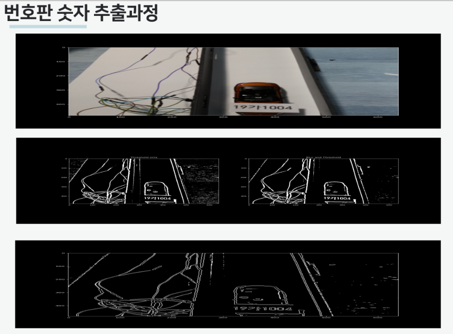
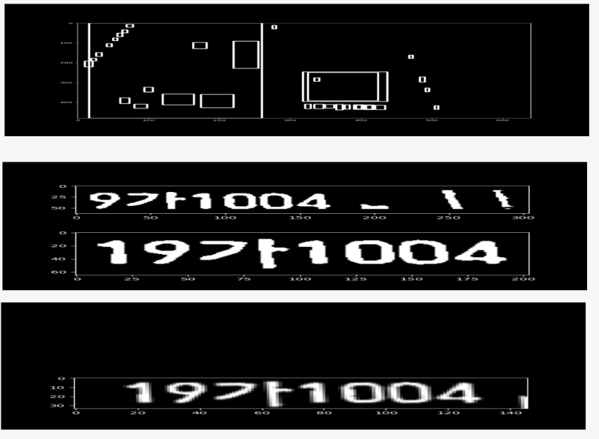
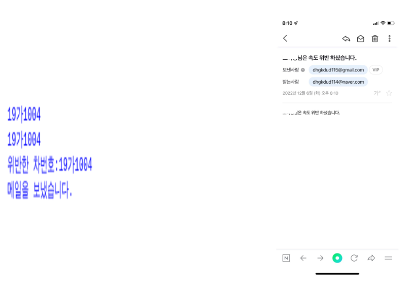

# 🚗 실시간 과속정보 전달서비스

## 📌 개요

운전자가 과속 여부를 인지하지 못해 과태료 고지서를 놓치는 불편함을 줄이기 위해,  
**차량 속도 측정 → 과속 감지 → 차량 번호 인식 → 이메일 전송**까지 자동으로 수행하는 실시간 시스템을 개발했습니다.

---

## 🎯 주요 기능

- 초음파 센서를 이용한 차량 속도 측정
- 과속 감지 시 카메라 촬영 자동 실행
- OCR 기반 번호판 문자 인식
- MySQL DB에서 사용자 정보 조회
- 이메일을 통한 실시간 과속 알림 전송

---

## 🛠 기술 스택

| 분류 | 기술 |
|------|------|
| 하드웨어 | Raspberry Pi, 초음파 센서 2개, Pi Camera |
| 프로그래밍 | Python (GPIO, OpenCV, pytesseract, picamera, smtplib) |
| 이미지 처리 | OpenCV, PIL, Tesseract OCR |
| 데이터베이스 | MySQL (python-mysqldb) |
| 기타 | SMTP(Gmail) 이메일 전송 |

---

## 🔁 시스템 흐름도

1. 차량이 센서 1 통과 → 시간 기록
2. 차량이 센서 2 통과 → 시간 기록
3. 두 센서 사이 이동 시간 계산 → 과속 판단
4. 과속일 경우, Pi Camera로 차량 촬영
5. 번호판 문자 인식 (OCR)
6. DB에서 차량 번호와 일치하는 사용자 정보 조회
7. 사용자 이메일로 알림 전송

---

## 🖼 예시 화면

> 📸 차량 번호 인식 결과 및 저장 이미지, OCR 출력 결과 등

    
    
    

---

## ⚙️ 실행 방법

1. Raspberry Pi에 센서와 카메라 연결
2. MySQL 서버 설정 및 차량 정보 등록
3. 메일 전송용 SMTP 계정 정보 등록 (`blog_mail()` 함수 내)
4. 아래 명령어 실행
